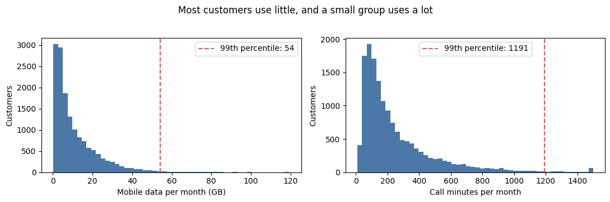
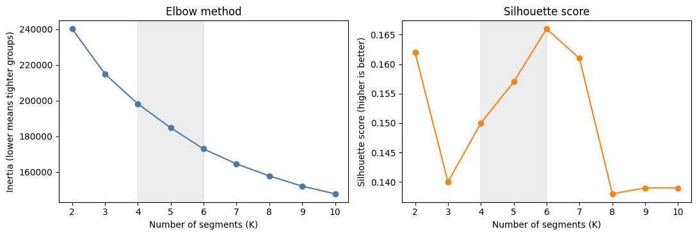
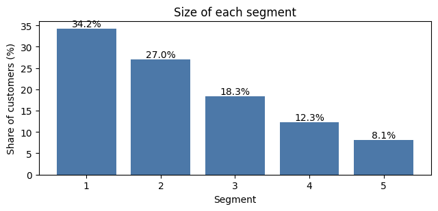
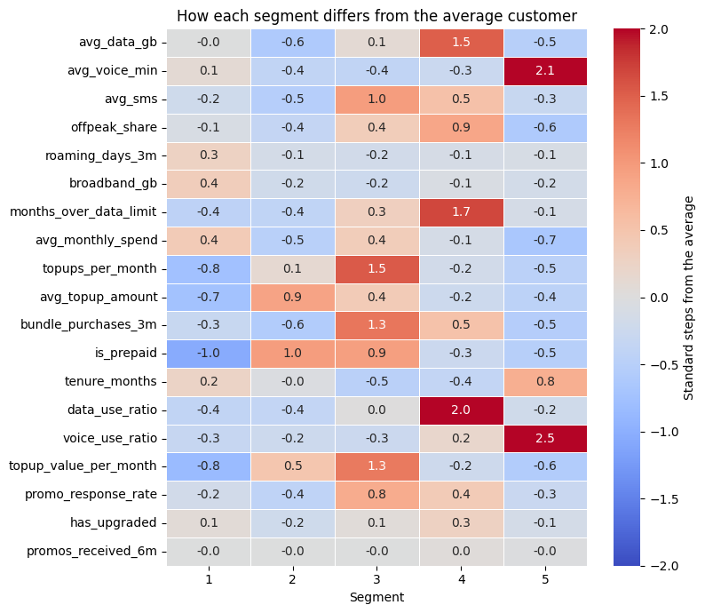
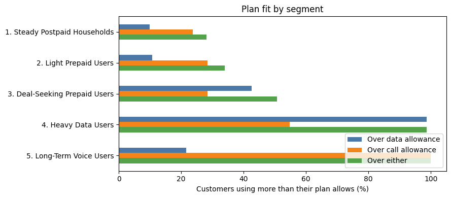

# TelcoX Customer Segmentation: Segmentation Analysis Summary

| | |
|---|---|
| **Project name** | TelcoX Customer Segmentation |
| **Document** | 06 Segmentation Analysis Summary |
| **Prepared by** | Walusungu Nyirenda |
| **Role** | Business Systems Analyst (case study) |
| **Related documents** | 03 Requirements and User Stories, 05 Data Quality and Preparation Report, Segmentation Analysis notebook |

---

## 1. Purpose of This Document

The full analysis is in the notebook `notebooks/segmentation_analysis.ipynb`, which runs from start to finish and gives the same results each time. This document is a short, plain-language summary of what the notebook did and found, for readers who do not want to open the code. It supports requirements FR6 to FR11.

The notebook has four stages:

| Stage | What happens | Requirements covered |
|---|---|---|
| 1. Data preparation | Check the data, fix problems, create new measures, and scale everything | FR2 to FR5 |
| 2. Choose the number of segments | Test 2 to 10 groups and pick the best number | FR6, FR8 |
| 3. Build the segments | Run K-means and test stability on subsamples | FR7 |
| 4. Profile the segments | Describe, name, and rank the segments | FR9 to FR11 |

---

## 2. Stage 1: Data Preparation

Stage 1 is described in full in document 05. The main points:

- 15,060 rows became 15,000 customers after 60 repeated records were removed.
- 33 plan records with the wrong allowance were corrected.
- Five new measures were created, such as the share of the data allowance a customer uses.
- 19 behavior features were chosen. Age, area, region, sign-up channel, plan, and gender were kept out so the groups come from behavior.
- Extreme values were limited at the 99th percentile for grouping, and every feature was scaled.

The figure below shows why this mattered. Most customers use little, and a small group uses a lot.

---

## 3. Stage 2: Choosing the Number of Segments

K-means needs the number of groups in advance. We tested 2 to 10 groups with three checks: the elbow method, the silhouette score, and stability.

| Groups (K) | Inertia drop from previous K | Silhouette score | Smallest group |
|---|---|---|---|
| 2 | not applicable | 0.162 | 48.0% |
| 3 | 10.5% | 0.140 | 25.9% |
| 4 | 7.8% | 0.150 | 13.0% |
| 5 | 6.7% | 0.157 | 8.1% |
| 6 | 6.4% | 0.166 | 4.9% |
| 7 | 4.8% | 0.161 | 4.7% |
| 8 | 4.1% | 0.138 | 4.7% |
| 9 | 3.6% | 0.139 | 4.6% |
| 10 | 2.8% | 0.139 | 3.9% |

**What the evidence shows**
- The elbow curve has no sharp bend. The gain from each extra group shrinks gradually.
- Silhouette scores are low for every K, between 0.14 and 0.17. Customer behavior changes gradually, so the groups overlap. The segments are a practical way to divide customers, not natural separate groups.
- Two groups score well but are too coarse for marketing. The requirements ask for 4 to 6 segments.
- Within 4 to 6, K=6 scores highest, but its smallest group (4.9%) falls just under the 5 percent minimum.
- Stability is almost perfect for 4, 5, and 6, so it does not help choose between them.

**Decision: K = 5.** It meets every requirement and is within 0.01 of the best silhouette score in the allowed range.

---

## 4. Stage 3: Building the Segments

K-means was run with five groups, and every customer was placed in exactly one. The segments are numbered from largest to smallest.

| Segment | Customers | Share |
|---|---|---|
| 1 | 5,137 | 34.2% |
| 2 | 4,051 | 27.0% |
| 3 | 2,749 | 18.3% |
| 4 | 1,848 | 12.3% |
| 5 | 1,215 | 8.1% |

**Stability test.** We took 20 random samples of 80 percent of the customers, built new segments from each sample, and compared them with the final segments. The average adjusted Rand index was 0.993, and the lowest was 0.985. On average 99.7 percent of customers landed in the same segment, and in the worst test 99.3 percent did. The borders between segments fall in nearly the same place each time, even though the groups overlap.

---

## 5. Stage 4: Profiling and Naming the Segments

The heatmap shows how far each segment's average sits from the average of all customers, in standard steps. Red is higher than average, and blue is lower.

The five segments were named from what the data shows. Full profiles are in document 07.

| Segment | Name |
|---|---|
| 1 | Steady Postpaid Households |
| 2 | Light Prepaid Users |
| 3 | Deal-Seeking Prepaid Users |
| 4 | Heavy Data Users |
| 5 | Long-Term Voice Users |

---

## 6. Upgrade Potential

Segments were ranked using three signs. **Need** is the share of customers who use more data or calls than their plan allows and are not on the top plan. **Past behavior** is the share who upgraded in the last 24 months. **Responsiveness** is the average share of promotions accepted. The score counts need for half and the other two signs for a quarter each.

| Rank | Segment | Need | Upgraded before | Promo response | Score |
|---|---|---|---|---|---|
| 1 | Heavy Data Users | 98.6% | 28.4% | 20.0% | 91.3 |
| 2 | Long-Term Voice Users | 99.3% | 12.2% | 7.1% | 56.1 |
| 3 | Deal-Seeking Prepaid Users | 50.6% | 19.7% | 27.4% | 54.6 |
| 4 | Steady Postpaid Households | 27.6% | 20.5% | 9.2% | 19.3 |
| 5 | Light Prepaid Users | 33.7% | 9.4% | 4.9% | 4.2 |

**Does the ranking depend on the weights?** The weights are a judgment call, so we checked two others.

| Segment | Chosen weights (50 / 25 / 25) | Equal weights | Need only |
|---|---|---|---|
| Heavy Data Users | 1 | 1 | 2 |
| Long-Term Voice Users | 2 | 3 | 1 |
| Deal-Seeking Prepaid Users | 3 | 2 | 3 |
| Steady Postpaid Households | 4 | 4 | 5 |
| Light Prepaid Users | 5 | 5 | 4 |

Heavy Data Users rank first under two of the three weightings. Long-Term Voice Users and Deal-Seeking Prepaid Users swap places 2 and 3. Steady Postpaid Households and Light Prepaid Users are always in the bottom two.

**Plan fit.** The chart shows the share of customers in each segment who use more than their plan allows.

---

## 7. Would Six Segments Be Better?

We built a six-segment version and compared it with the five-segment one. Five of the six groups were almost unchanged, each at least 98.7 percent made up of one original segment. The sixth group held 4.9 percent of customers and was carved out of Steady Postpaid Households, with about 12 percent of that segment moving into it. Its customers spend about 45 instead of 31, and roam abroad on about 8.5 days in three months. That is a real group, but at 4.9 percent it is just under the 5 percent minimum. We kept five segments and noted the roaming customers as a targeted add-on in document 08.

---

## 8. Limits of the Analysis

- The data is synthetic, so the segments show how the method works and do not describe real customers.
- The segments overlap, so some customers near the borders could fit two segments.
- The upgrade ranking depends on the chosen weights.
- Cleaning choices, such as limiting values at the 99th percentile, affect the segments. We did not test how much.
- Names and numbers belong to the data created with seed 42. A different seed can change them.
