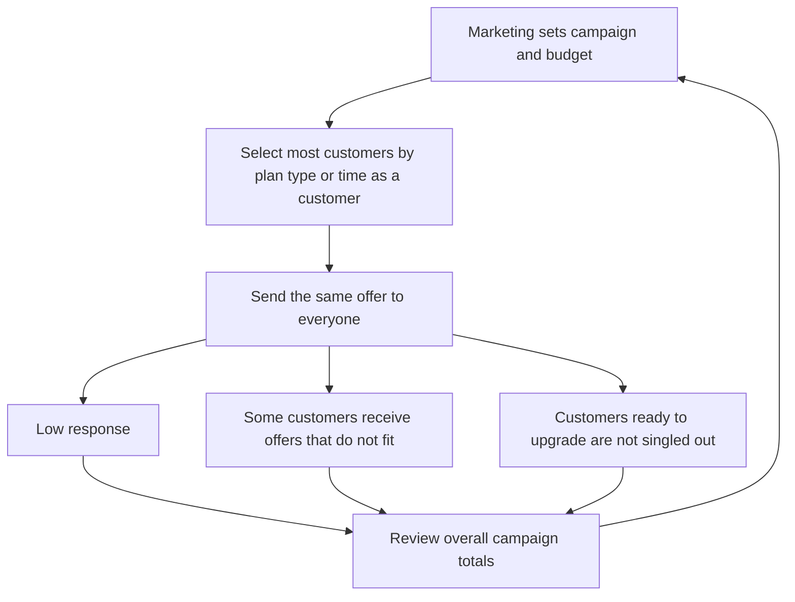
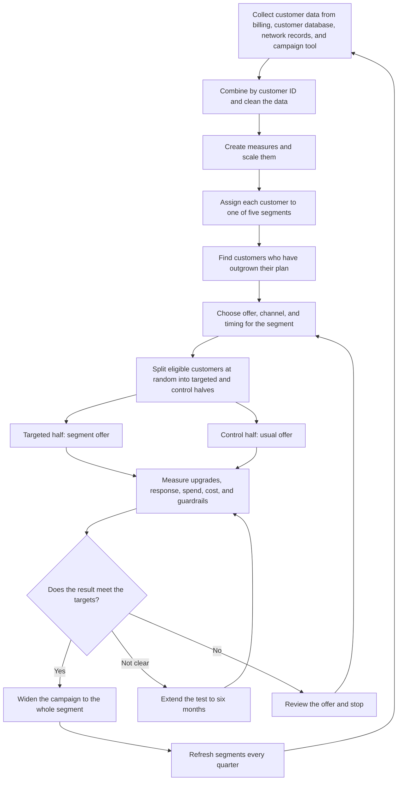

# TelcoX Customer Segmentation: Process Flow

| | |
|---|---|
| **Project name** | TelcoX Customer Segmentation |
| **Document** | 11 Process Flow (optional deliverable) |
| **Prepared by** | Walusungu Nyirenda |
| **Role** | Business Systems Analyst (case study) |
| **Related documents** | 01 Business Requirements, 08 Marketing Recommendations, 09 KPI and Measurement Plan |

---

## 1. Purpose of This Document

This document shows how TelcoX runs marketing campaigns today and how the process changes with customer segments. The diagrams use Mermaid, which GitHub displays as pictures when the file is opened in the repository.

---

## 2. Current Process: Broad Campaigns

Today, most customers receive the same offers, and results are judged by overall totals.

**What goes wrong:** response is low, spending is high, and nobody learns which customers were ready to upgrade.

---

## 3. Proposed Process: Segment-Driven Campaigns

The proposed process uses customer behavior to decide who gets which offer, and tests the result against the usual approach.

---

## 4. Who Does What

| Step | What happens | Owner | Supporting team |
|---|---|---|---|
| Collect and combine data | Pull the four data sources into one customer table | IT and data team | Business systems analyst |
| Clean and prepare | Fix problems, create measures, scale | Business systems analyst | IT and data team |
| Assign segments | Run the segmentation and save each customer's segment | Business systems analyst | Data team |
| Find customers who have outgrown their plan | Apply the need rule | Business systems analyst | Product and pricing team |
| Choose offer, channel, and timing | Use document 08 and agree the incentive amounts | Marketing | Product and pricing team |
| Check privacy | Review the data fields and who can see segment labels | Legal and compliance team | Data team |
| Split and send | Create the two groups and run the campaign | Marketing | IT and data team |
| Brief front-line staff | Share shop guides and care briefing | Sales and retail, customer care | Marketing |
| Measure and decide | Report results and apply the decision rule | Business systems analyst | Marketing, leadership |
| Refresh | Rerun the segmentation each quarter | Business systems analyst | Data team |

---

## 5. What Changes

| | Today | With segments |
|---|---|---|
| Who gets an offer | Most customers | Customers who match their segment and have outgrown their plan |
| What they receive | The same offer | An offer built for their segment |
| Channel and timing | Whatever suits the campaign | The channel and moment that fit the segment |
| How results are judged | Overall totals | Targeted group compared with a control group |
| How often it is reviewed | After each campaign | Each campaign, with segments refreshed every quarter |
